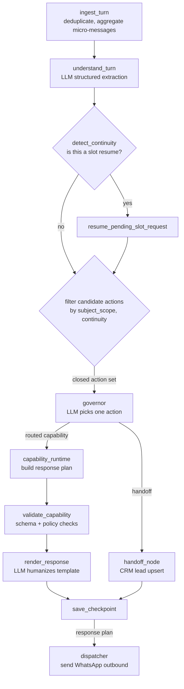

# Architecture Deep Dive

This document covers the architectural decisions behind PMI and the trade-offs they imply. It assumes you have read the [README](./README.md).

Everything here is paraphrased from the private implementation. Code snippets are shortened for clarity and comments translated where necessary. Where the production code is in Spanish because it is customer-facing, the Spanish is preserved.

---

## 1. The Conversation Pipeline

Every inbound customer turn runs through a graph with these phases:



Three LLM calls per non-trivial turn: **understanding, governor, renderer**. Each has its own structured-output schema. The runtime between them is deterministic.

---

## 2. The Understanding → Governor → Renderer Contract

The most consequential decision in the project is strict role separation across the three LLMs.

### Understanding

**Role:** semantic comprehension of the customer message in context.

Inputs:
- Message plus any micro-messages aggregated in the same turn window.
- Conversation history, previous state snapshot, media classifications, media captions.
- The tenant's full context: capabilities with aliases and content previews, partners with identity hints, glossary, personality.

Outputs (schema-validated):
- `intent` from a canonical enum.
- `subject_scope`: `main_business | partner_entity | unknown | null`.
- `signals`: array of conversational signals (`greeting`, `closure`, `off_topic`, `negative_slot_response`, `prescription_provided`, etc.).
- `entities`: typed fields (`branch_choice`, `information_focus`, `graduation_mode`, …).
- `slot_payload_resolution`: `{ status, response_polarity, value_type, value_text }`.
- `evidence_spans`, `rationale_short`, `topic_reference`.

**What it does NOT do:**
- No action routing.
- No decisions about which capability to execute.
- A `suggested_capability` field survives for backward compatibility but is explicitly ignored by downstream decision logic.

### Governor

**Role:** pick ONE action from a closed set that the runtime enumerates.

Inputs:
- The customer message.
- The closed action set, filtered by the runtime based on tenant catalog and conversational state.
- The understanding snapshot as auxiliary context.

Outputs (schema-validated):
- `decision_id` from the offered set.
- `rationale`, `confidence`, `evidence`.

**What it does NOT do:**
- Re-run comprehension work the understanding already did.
- Produce free-form intents outside the offered set.
- Decide the final text to the customer (that is the renderer's job).

### Renderer

**Role:** compose the final text for the customer, respecting operational constraints.

Inputs:
- The template produced by the capability runtime.
- Immutable regions that must appear verbatim.
- A `render_mode` hint when the capability allows selective composition.
- Conversation history and tenant personality.

Outputs:
- Final text, or `template_fallback` if the LLM output fails validation.

**What it does NOT do:**
- Decide which capability to run.
- Invent facts not present in the template or in the official data for the tenant.

### What breaks when the contract is violated

Early iterations had a fourth LLM — a "resolver" — inside the knowledge-answering capability that would re-read the catalog of knowledge entries and pick one. It was introduced when the governor did not yet see the knowledge catalog as context, so somebody had to disambiguate.

Months later, the governor was given visibility into the knowledge topics as part of its action set. The resolver became redundant but was not removed. Worse, it accumulated new decision branches (`resolved_multi`, `resolved_confirmation`) that duplicated semantic analysis already done upstream.

Symptoms observed in production:

- The resolver sometimes contradicted the governor on which entry to pick (governor correctly identified `payment_methods` as the topic; the resolver, seeing an attached image classified as a prescription, re-biased toward a different entry and the renderer produced a confidently wrong answer).
- Latency added by one extra LLM call per knowledge turn (~2s).
- Prompt complexity in the renderer grew to compensate for inconsistent inputs from the resolver.

Resolution: rolled back the resolver's expansion commits as a block, kept the base path, and moved the humanization decisions directly to the renderer with an opt-in `render_mode` field on each knowledge entry. One LLM per responsibility, no duplication.

The underlying principle (now encoded in a steering document consumed by every AI-assisted code change):

> Facts from Understanding constrain the action space.
> The Governor decides within that constrained space.
> The Renderer composes text respecting operational constraints.
> No short-circuits. No cross-layer re-analysis. No fourth LLM.

---

## 3. Multi-tenant Without Hardcoded Vocabulary

PMI serves multiple tenants in different verticals (today: an optical retailer; roadmap: a clinic, a hardware store). The code must know nothing about any specific vertical.

**Hard rules enforced in code review and in the steering doc for AI-assisted edits:**

- No lists of industry-specific terms baked into the runtime (`["ferreterías", "ópticas", …]` is a bug, not a feature).
- No regex for product names or business concepts.
- All tenant-specific vocabulary lives in the tenant's `capability_catalog`: aliases per knowledge entry, identity hints per partner, business hints per capability.

**How routing works without hardcoded terms:**

The runtime builds a closed action set per turn. For each capability enabled by the tenant, the catalog ships with:
- `aliases`: tenant-authored synonyms the customer might use.
- `content_preview`: a short description of what the capability covers.
- `partners[].identity_hints` and `.business_hints` for partner-entity scope detection.

The governor sees these as part of each offered action, so it can reason semantically about the fit without the runtime having opinions about industry.

Example — one tenant's `payment_methods` entry (keys preserved from production, values are illustrative):

```jsonc
{
  "key": "formas_de_pago",
  "title": "Formas de pago",
  "intro": "Trabajamos con las siguientes formas de pago:",
  "value": "- Efectivo\n- Tarjetas de crédito o débito\n- QR\n- Transferencia bancaria\n- Cuotas sólo con tarjetas de crédito",
  "aliases": ["pago", "pagos", "medios de pago", "tarjeta", "qr", "transferencia", "efectivo", "cuotas"],
  "mode": "inform",
  "render_mode": "selective",
  "follow_up_media_handoff": true
}
```

Zero of this is in code. Everything is in the tenant's contract.

---

## 4. Humanization With Selective Rendering

### Problem

A customer asks: *"Can I pay with QR?"*

A naive bot that answers from a knowledge entry responds with the full catalog:

> Payment methods available:
> - Cash
> - Credit or debit cards from any bank
> - QR
> - Bank transfer
> - Instalments only with credit cards

Technically correct. Experientially robotic, and worse, it feels restrictive: the customer who asked a yes/no question gets a list that implies "these are the only options I will acknowledge."

The tenant's feedback was concrete: *"a human would just say 'yes, we accept it' and move on."*

### Options considered

1. Teach the renderer to always answer the specific question. Fast, but risky: the renderer could skip required disclosures or invent data for entries that must be presented verbatim (addresses, bank account numbers, prices).
2. Classify each incoming message as "specific question" vs. "open question" via another LLM. Adds latency and still relies on classification that could go wrong on edge cases.
3. **Per-entry opt-in flag that the tenant sets explicitly.** For entries that are enumerative catalogs, the renderer is free to answer selectively. For entries that are hard data (bank details, phone numbers, prices), the value remains an immutable region and must appear verbatim.

Chose option 3.

### Design

Each knowledge entry has an optional `render_mode: 'strict' | 'selective'`. Absence equals `strict` (fully backward-compatible with historical entries).

- `strict`: the entry's `value` is passed to the renderer and declared as an immutable region. A char-by-char guardrail verifies the final output contains the value literally. If it does not, fallback to the untouched template.
- `selective`: the `value` passes to the renderer as a reference catalog (not immutable). The renderer is instructed, via a dedicated prompt section, to answer the specific question when the customer asks about specific items, and to produce the full catalog when the customer asks the general question.

Guardrails baked into the selective prompt:

- If the customer mentions items that ARE in the catalog, confirm succinctly, no enumeration.
- If the customer mentions items that are NOT in the catalog, say so explicitly. Never invent availability.
- If the question is general ("what payment methods do you accept?"), deliver the full catalog as it appears.
- When in doubt, treat as specific. Less verbose is more human.

### UI exposure

The admin UI exposes a per-entry checkbox: *"Allow selective humanization of the catalog."* The tenant decides which entries are safe to opt in. Operational data (bank details, addresses, phone numbers, prices) stays `strict` by default; the UI copy explicitly warns against enabling `selective` for those.

### Defensive persistence

A bug caught in retest: a tenant edit through the admin UI could silently blow away the `render_mode` flag on entries, because the UI was initially unaware of the field. The PATCH endpoint now maintains a `Map<entry.key, render_mode>` from the current contract state and preserves the previous value when the incoming payload omits the field. UI payloads emit the flag explicitly in both states (`'selective'` or `'strict'`) so an uncheck correctly overrides a previous selective.

### Result (same question, same tenant, after rollout)

Customer: *"Can I pay with QR?"*

Bot: *"Yes, you can."*

Customer: *"What payment methods do you have?"*

Bot: *"We work with: cash, credit or debit cards from any bank, QR, bank transfer, and instalments only with credit cards."*

Verbatim catalog preserved when the question warrants it; natural confirmation when it does not.

---

## 5. Deterministic Guardrails on Top of LLMs

LLM output is treated as untrusted by the runtime. Several layers:

### Immutable regions

The capability runtime declares, for each response, substrings that must appear verbatim. Examples:
- Bank account details.
- Phone numbers and addresses.
- Follow-up questions that are part of a slot flow and belong to a strict contract with the customer.

After the renderer emits text, a validator scans for each declared immutable region and verifies character-by-character presence. If one is missing, the response is rejected and the untouched template is sent instead.

### Closed action set

The governor never sees "pick any capability." It sees a bounded list enumerated by the runtime, filtered by:
- `subject_scope` from the understanding (if the customer is clearly asking about a partner entity, main-business capabilities are not offered, and vice versa).
- Slot continuity (if there is an active slot flow, divergent capabilities are retracted so the governor can route to the new topic, but slot-resolution actions remain for topical continuity).
- Tenant catalog (only capabilities the tenant has enabled).

The schema itself constrains the governor's output to one of the offered `decision_id` values.

### Suppression markers

Signals from the understanding (`not_applicable`, `help_request`, `negative_slot_response`) and from the governor (`fallback_reason: blocked`) propagate as explicit markers in the response plan. The dispatcher and the renderer both check for these and short-circuit appropriately. No implicit "the LLM said something ambiguous, let's hope for the best."

### Fallback chains at every LLM boundary

- Understanding call fails → structured fallback with `intent: 'unknown'` and conservative signals.
- Governor call fails → fallback to the handoff capability with reason `UNRESOLVED_QUERY`.
- Renderer call fails → fallback to the raw template.
- Any schema validation failure → the specific layer's fallback engages.

The system never emits "null," never emits raw prompt bleed-through, never emits a half-rendered template.

---

## 6. Observability and the Feedback Loop

Every turn persists an audit record in `langgraph_turn_diagnostics`:
- `trace_path`: ordered list of graph nodes visited.
- `understanding`: full snapshot of the understanding output.
- `governor`: decision, evidence, rationale, confidence.
- `response_text`: what was actually sent.
- `timing`: millisecond-level timings per node.

The admin UI exposes a "Bot Lab" view that lets a QA tester mark feedback on specific turns, with retest sessions that are first-class entities. Each feedback has:
- `memo` from the tester.
- `sessions[]` with start/end timestamps capturing retest windows.
- `resolution_history[]` with comments from engineers on fixes applied.
- `status`: `pending | in_review | resolved`.
- `outcome`: `success | improvement | regression`.

The combination `(trace_path, understanding, governor)` lets an engineer reconstruct exactly why a turn produced the output it produced, without replaying the LLM calls.

Example scenario the loop caught (abbreviated):

- Tester reports: *"The bot derived to agent without greeting first; I only sent an image."*
- Diagnostics show: understanding emitted `intent: unknown` with rationale *"only metadata of the attachment, no operative text."*
- Root cause: the function building the turn package was replacing the customer's caption with just the vision metadata hint, so the comprehension layer never saw what the customer actually wrote.
- Fix: concatenate caption and vision hint. Comprehension receives both; the governor can route to a real capability instead of falling back to handoff.

Having the diagnostic trail turned a 20-minute debugging exercise instead of a half-day of replaying production traffic.

---

## 7. A Second Production Bug Worth Mentioning

While rolling out selective humanization, a regression appeared in retest: a knowledge entry that was marked `render_mode: 'selective'` via SQL migration suddenly behaved like `strict` again. The customer-facing symptom was the exact pre-fix verbosity the feature was meant to eliminate.

Investigation:
- The migration had set the flag correctly.
- A tenant edit through the admin UI, done hours later for an unrelated change, had re-saved the entry.
- The admin UI did not yet expose the `render_mode` field.
- The PATCH endpoint built the entry fresh from the payload, dropping any field not present.
- Result: silent deletion of the flag through a completely unrelated edit.

Fix had two layers:

1. UI now exposes the field, so tenants have direct control and the save payload includes the flag explicitly.
2. PATCH endpoint builds a key-to-previous-value map from the current contract state before processing the incoming payload. If the payload omits the field, the previous value is preserved. This protects against external PATCH callers that might not know the field exists.

The design lesson is a general one for multi-tenant SaaS: **any opt-in field persisted alongside tenant-editable data needs a merge policy, not an overwrite policy, unless the UI explicitly represents every field it is capable of overwriting.**

---

## 8. Trade-offs Not Yet Resolved

Honest list of what the current design does not handle gracefully:

- **Multi-topic knowledge responses.** When a customer asks two unrelated knowledge questions in a single turn ("where are you located AND what are your hours?"), the system currently prioritizes one. Early experiments with multi-topic responses existed and were partially rolled back along with the resolver cleanup. A clean redesign is pending.
- **Cost tracking per LLM call.** Logs capture provider and model, but there is no per-tenant aggregation surface yet. Needed before onboarding a second tenant with volume differences.
- **Partner-entity disambiguation.** When a customer references a partner (e.g. a doctor's practice that shares the WhatsApp channel), identity hints work well. Business hints occasionally mis-classify when the customer uses ambiguous verbs ("I want to pay" could be either). A richer hint schema (verbs vs. nouns) is on the roadmap.
- **Testing surface.** The feedback-marker workflow is excellent for a single tester working with a single tenant. It does not yet have a replay harness that can run a batch of past turns against new graph code before deploy. Current practice is manual regression on a bot-lab tenant plus production retests.

Being clear about these is as useful for a reader as the parts that work.

---

## 9. What a Reader Can Take From This

If you are evaluating the project as a hiring signal:

- The design makes a bet that most of the robustness problems of LLM-driven conversational systems come from role mixing between LLMs and from treating LLM output as trusted. The guardrails and the three-role contract are the two decisions that make the rest tractable.
- The code enforces its own architectural principles through a short set of steering documents consumed by AI-assisted editing. Non-trivial changes propose themselves against those documents; drift gets caught early.
- Shipping to a real tenant surfaced bugs that no synthetic test would have found (caption dropped by vision hint, flag erased by unrelated UI edit). The investigation style — grounded in diagnostics tables and git archaeology, not in guessing — is a bigger artifact than any specific feature.

---

## Credits and Access

Design, implementation and tenant onboarding by *[your name]*. Testing by the tenant's operational team in Paraguay.

For technical interviews or deeper discussion, happy to share the private repository and walk through the pieces that are not public. Contact details are in the [README](./README.md).
