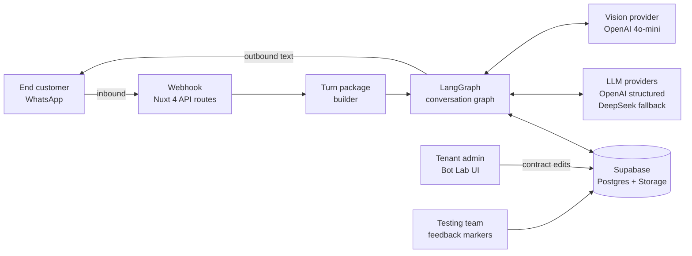

# PMI — Multi-channel Conversational AI Platform

**PMI** stands for *Plataforma de Multi-atención Inteligente* (Intelligent Multi-channel Support Platform).

> A multi-tenant SaaS platform that gives small and mid-size businesses a conversational AI assistant across messaging channels (WhatsApp first), with tenant-level governance, auditability and human handoff.

**Status:** In production. One live pilot tenant in Paraguay (retail, vision care) handling real customer traffic since mid-2026.

> This repository is a case study of the architecture and some of the engineering decisions behind the project. The implementation lives in a private repository. Access can be arranged on request for recruiters or technical leads.
>
> The operational system is in Spanish because it serves end customers in Paraguay. This document is in English for broader readability; code snippets preserve the original Spanish where relevant.

---

## TL;DR

- Multi-tenant conversational AI with per-tenant capability catalogs, no hardcoded business vocabulary.
- Pipeline splits comprehension (Understanding), action selection (Governor) and surface rendering (Renderer) into isolated LLM roles with a strict contract between them.
- Structured outputs end-to-end: every LLM call returns a schema-validated payload, never free-form text that the runtime has to parse.
- Deterministic guardrails on top of LLMs: immutable regions enforced character-by-character, closed action sets for the governor, template fallbacks on every LLM failure path.
- Full observability: every turn persists a trace path, understanding snapshot, governor decision and renderer output for post-mortem.
- Operates on top of LangGraph, Supabase, Nuxt 4 and a mix of OpenAI structured outputs and DeepSeek as fallback.

---

## Key Features

- **WhatsApp AI assistant.** Answers customer inquiries 24/7 using each tenant's own information and business rules, and hands off to a human when needed.
- **Bot Lab.** The assistant is trained and tuned per tenant here: simulate conversations, review the trace of every turn and audit each answer before it reaches customers.
- **Kanban board.** Customer cases are tracked on a board so the team can follow each one from first contact to resolution.
- **Analytics.** Statistics on conversations and support performance, so tenants can see how their customer service is going.
- **Multi-tenant admin.** Each business configures its knowledge, business rules and handoff policies from the admin UI, without touching code.

---

## Why This Project Exists

Small businesses in Latin America absorb a lot of repetitive customer messages across WhatsApp: hours, location, payment methods, order status, pricing questions, prescription requirements. Most off-the-shelf chatbots either (a) require programming per tenant, (b) hallucinate business-specific facts, or (c) have no auditability when a conversation goes wrong.

PMI targets a specific niche: a platform where a non-technical tenant can configure their own knowledge, business rules and handoff policies through an admin UI, and the runtime executes a conversational pipeline that is both powerful (LLM-driven comprehension) and safe (deterministic guardrails on data that must be presented verbatim).

---

## High-level Architecture

Three independent surfaces:

1. **Runtime** (LangGraph service) consumes a *turn package* and emits a *response plan*. Entirely stateless; state lives in Supabase.
2. **Nuxt 4 app** handles the WhatsApp webhook, exposes the Bot Lab admin UI, and renders the tenant-facing dashboard.
3. **Supabase** persists tenant contracts, business rules, conversations, messages, decision packets and per-turn diagnostics.

---

## Deep Dive

A separate document covers the architectural decisions and the engineering trade-offs in detail:

**→ [ARCHITECTURE.md](./ARCHITECTURE.md)**

Topics covered there:

- The Understanding → Governor → Renderer contract (and what breaks when it is violated).
- Multi-tenant without hardcoded vocabulary.
- Humanization with opt-in selective rendering of enumerative catalogs.
- Deterministic guardrails on top of LLM output.
- Observability and the tenant feedback loop.
- Two concrete production bugs and their resolution.

---

## Stack

| Layer | Choice | Notes |
|---|---|---|
| Admin UI | Nuxt 4 + Vue 3 | SSR, Tailwind, Pinia-less composables. |
| API | Nuxt 4 server routes | TypeScript end-to-end. |
| Conversational runtime | LangGraph (JS) | Custom graph nodes, not pre-built agents. |
| Primary LLM | OpenAI structured outputs | GPT-6 family (Luna / Sol / Astra depending on role). |
| Fallback LLM | DeepSeek structured | For resilience and cost benchmarking. |
| Vision | OpenAI 4o-mini | Image classification into tenant-defined document types. |
| Database | Supabase Postgres | Row-level security, extensive JSONB. |
| Storage | Cloudflare R2 (via Supabase) | Inbound media. |
| Messaging | Zernio | WhatsApp Business API provider. |
| Hosting | Coolify (self-hosted) | On a private VPS. |
| Observability | Postgres-backed | `langgraph_turn_diagnostics` + structured logs. |

---

## Status and Roadmap

**Deployed and live:**

- WhatsApp inbound → conversational response pipeline.
- Tenant contract editor with capability catalog, knowledge entries, business rules, handoff policies.
- Human handoff with CRM lead upsert.
- Vision for inbound images (prescription vs. receipt vs. password-slip vs. other).
- Per-tenant observability dashboard with feedback markers.
- Kanban board for case follow-up and conversation analytics.

**Shipped recently:**

- `render_mode: 'selective'` per knowledge entry: enumerative catalogs (payment methods, services) can be answered in a focused way instead of dumping the full list.
- Caption-aware vision hints: when a customer sends an image with a text caption, both are passed to the comprehension layer.
- First-turn greeting prefix across early-return paths.

**Next on the roadmap:**

- Granular LLM cost tracking per tenant / per role.
- Semi-structured product catalog capability for retailers with SKUs.
- Second pilot tenant in a different vertical to validate the multi-tenant abstractions.

---

## Repository Access

Source code is private due to real tenant data in production migrations and git history. Access on request for:

- Technical recruiters evaluating senior / staff engineering candidacy.
- Engineering managers interested in the design patterns.
- Collaborators considering joining the project.

Contact: *contacto@gusmaciel.com / https://www.linkedin.com/in/gusmacielpy*

Portfolio: https://gusmaciel.com
